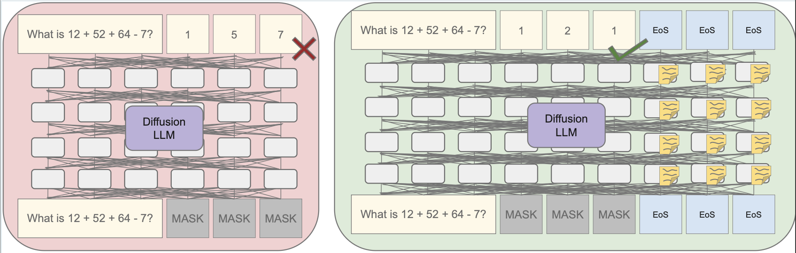

# Diffusion LLMs can think eos-by-eos 

This repository contains code and datasets to reproduce the experiments from the paper [Masked diffusion LLMs can use EoS tokens for hidden reasoning](https://arxiv.org/abs/2603.05197). 



- A prompting experiment to compare autoregressive and diffusion LLMs without chain of thought on the tasks Addition, Entity Tracking, and Sudoku, where we find that diffusion LLMs outperform autoregressive ones given a sufficiently high generation length. They pad the additional space with EoS tokens.
Therefore, we hypothesize that diffusion LLMs use the EoS tokens as additional compute, which we name thinking EoS-by-EoS
- A controlled prompting experiment in which we keep the number of masks to predict constant and augment an increasing number of EoS tokens in the start state. We find that EoS tokens have a positive impact on the performance of LLaDA1.5 and Dream v0, but not on LLaDA2.0.
- Causal interventions that swap the hidden states of the EoS tokens between an original and a counterfactual run, which shows that they contain reasoning towards the final generation.
- The setup of the controlled prompting experiment applied to two more naturalistic datasets, gsm8k and two-hop.
- Additional experiments with other potential reasoning tokens (dots, whitespaces, random tokens) replicating the setup of the controlled prompting experiment and the activation patching.

## Setup
All required packages can be found in requirements.txt. You can install them with ```pip install -r requirements.txt```

## Usage
The folder ```src/data_generation``` contains the scripts to generate datapoints for the Addition and Entity Tracking tasks. The Sudokus can be generated with [Sudoku4LLM](https://github.com/DolbyUUU/Sudoku4LLM). Our exact datasets can be found in ```datasets```. Moreover, this repository contains code to pad EoS tokens into the starting state, to prompt the LLMs, and to perform activation patching, as well as the evaluation scripts. The file ```run_experiments.sh``` contains all commands to replicate the results for one model. 


## Citation
If you use this code in your work, please cite the paper:
```
@misc{breckner2026maskeddiffusionllmsuse,
      title={Masked diffusion LLMs can use EoS tokens for hidden reasoning}, 
      author={Sarah Breckner and Sebastian Schuster},
      year={2026},
      eprint={2603.05197},
      archivePrefix={arXiv},
      primaryClass={cs.CL},
      url={https://arxiv.org/abs/2603.05197}, 
}
```
